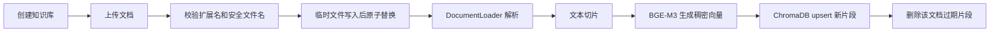
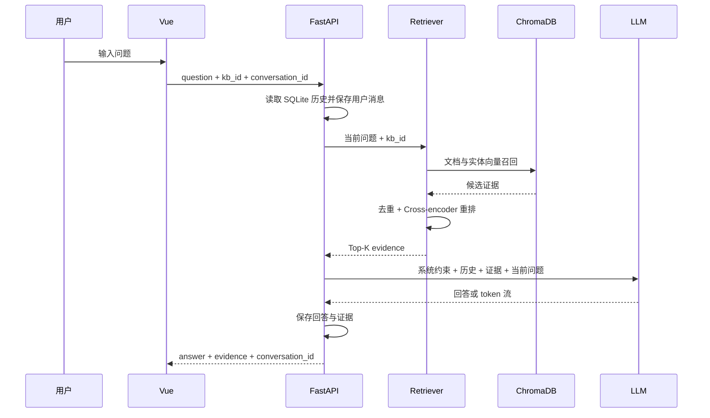
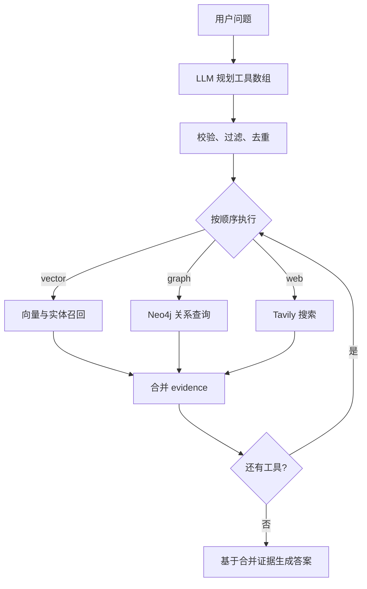

# AgenticRAG 面试讲解手册

## 1. 一句话介绍

这是一个面向私有知识库的多源 RAG 问答系统。用户上传文档后，系统完成解析、切片、向量化和持久化；提问时可以直接做向量检索，也可以让 LangGraph Agent 在向量检索、知识图谱和联网搜索之间选择工具，最后把证据连同历史对话交给大模型，通过 SSE 流式返回答案。

项目的重点不只是“调用一次大模型”，而是把数据进入系统、证据检索、回答生成、流式传输和数据更新做成一条可维护的链路。

## 2. 系统分层

| 层 | 主要技术 | 职责 |
| --- | --- | --- |
| 前端 | Vue 3、TypeScript、Vite | 会话管理、知识库操作、SSE 消费、Markdown 和图谱展示 |
| API | FastAPI、sse-starlette | 参数校验、接口编排、错误转换、流式响应 |
| Agent | LangGraph、LLM | 根据问题规划 vector、graph、web 工具并顺序执行 |
| RAG | BGE-M3、BGE reranker、ChromaDB | 文档向量化、召回、去重、重排和知识库隔离 |
| 图谱 | LLM/VLM、Neo4j、D3.js | 抽取三元组、保存实体关系、关系检索和可视化 |
| 状态与文件 | SQLite、JSON、本地文件 | 对话历史、知识库元数据、源文档和本地图数据 |

入口是 `backend/src/main.py`，它负责把服务连接起来；具体能力分别下沉到 `rag`、`agent` 和 `services`，前端通过 `frontend/src/utils` 中的 API/SSE 封装调用后端。

## 3. 文档进入系统的流程

关键实现：

1. 上传文件先写入同目录临时文件，再执行原子替换，避免中途失败留下半个文件。
2. 文件名必须是单一普通文件名，拒绝绝对路径、`..` 和嵌套目录，防止目录逃逸。
3. `DocumentLoader` 按文件类型解析。复杂 Office 格式依赖缺失时明确报错，不把二进制内容当 UTF-8 文本读取。
4. 每个切片带有 `type=document`、`kb_id`、`source` 和 `chunk_index` 元数据。
5. 切片 ID 由知识库、来源、序号和内容计算 SHA-256，因此重复索引不会无限追加重复数据。
6. 更新采用“先写新片段，再删除旧片段”的顺序。解析、向量化或 upsert 失败时，旧索引仍可使用。
7. 同一个知识库的上传、索引、删除和建图使用进程内锁串行执行，避免并发修改互相覆盖。

面试时可以强调：这里追求的是失败时保留最后一份可用数据。它不是跨 ChromaDB、Neo4j 和文件系统的真正分布式事务；生产环境可进一步使用任务队列、版本化索引和补偿任务。

## 4. 普通 RAG 问答流程

检索阶段先用 BGE-M3 把问题编码成稠密向量，从 ChromaDB 召回较多候选；随后用 Cross-encoder 对“问题—片段”对重新评分，保留前几条。Bi-encoder 适合快速大规模召回，Cross-encoder 会联合编码问题和片段，速度较慢但排序通常更精细，两阶段组合兼顾速度与相关性。

`kb_id` 会进入向量查询条件，避免指定知识库时读到其他库。最终 evidence 统一包含 `id`、`text`、`source`、`score` 和 `type`，生成层不需要了解证据来自 ChromaDB、Neo4j 还是 Tavily。

提示词要求模型严格依据参考资料，无资料时明确说明未提及，并在使用证据的陈述后写 `[n]`。前端只把确实存在的证据编号变成可点击引用，点击跳到对应片段。编号有效并不意味着这段证据真的支持结论，仍需人工或独立评测检查忠实度。

## 5. Agentic RAG 流程

开启深度模式后，问题先进入 LangGraph：

路由模型只能从本次允许的工具集合中选择。输出必须是 JSON 数组，系统还会做类型检查、白名单过滤和顺序去重；关闭联网时，即使模型返回 `web` 也会被过滤；输出异常或为空时回退到 `vector`。每个工具失败只记录日志并继续执行其他工具，实现局部降级。

这个项目当前属于“LLM 动态工具路由”的 Agentic RAG。它还没有复杂问题拆解、证据反馈后的二次规划、自我反思和多轮事实核验。面试时准确说明边界，比把它包装成全自主 Agent 更可信。

## 6. 知识图谱流程

构建图谱时，文本被切成较大的片段并并行交给 LLM 抽取 `subject-relation-object`；图片优先交给视觉模型，失败时尝试 OCR。系统对实体和关系去重，保存本地 `graph.json`，再同步到 Neo4j，并为实体生成向量以支持实体召回。

查询 Neo4j 时使用参数化 Cypher，并把 `kb_id` 作为实体与关系的隔离条件。图数据库记录会转换成统一 evidence，再进入生成提示词。Neo4j 不可用时，普通向量问答仍可运行；图谱同步失败会作为 warning 返回给前端。

## 7. SSE 流式链路

后端依次发送 `start`、`status`、检索工具的 `tool_start/tool_end`、`token`、`done`，失败时增加 `error`。工具事件带会话 ID、工具名称、成功状态、证据数和耗时；前端实时显示时间线并保留在该次回答里。事件的 ID 显式传递，SSE 编码器不保存共享会话状态，因此交错请求不会串号。

前端没有假设一次网络读取就是一个完整事件，而是使用带缓冲的解析器处理：

- 一个事件跨多个网络 chunk；
- 一个 chunk 包含多个事件；
- LF 和 CRLF；
- 多行 `data`；
- UTF-8 汉字被拆到两个字节块；
- 连接结束前的最后一段缓冲。

请求会绑定发起时的前端会话。用户中途切换页面，结果仍写回原会话；AbortController 支持停止生成；HTTP 错误、SSE error 和未收到 done 的断流都会变成可见消息；`finally` 保证发送状态恢复，用户可以继续提问。

停止时服务端设置请求级取消标记，后续未开始的工具不再执行；已经运行的同步嵌入、模型或搜索无法马上中断。这是线程卸载与真正可取消后台任务的边界。

## 8. 会话如何保持

前端用本地存储保存聊天列表，每个会话有自己的 `serverId`。后端用 SQLite 保存 user/assistant 两类完整消息、证据 JSON 和 UTC 时间。收到新问题时，后端读取最近消息并在字符预算内格式化成历史上下文。

当前历史参与答案生成，但检索仍只使用当前问题。例如“它有什么优点”没有先改写成包含实体名的独立问题，这可能降低召回率。后续可增加 query rewriting：先结合历史把追问改写成独立查询，再做检索，同时保留原问题用于最终回答。

## 9. 本次可靠性优化可以怎样讲

可以按“问题—设计—结果”回答：

1. **流式解析不可靠**：网络分包没有消息边界。抽出增量 SSE parser，并覆盖分包、CRLF、多事件和 UTF-8 测试。
2. **并发会话可能串 ID**：共享 SSE 状态不属于任何单次请求。改为显式传递 conversation ID，并把请求绑定到发起时的前端会话。
3. **后端重启丢历史**：进程内字典无法持久化。改用 SQLite，每次操作使用独立连接以适应 FastAPI 工作线程。
4. **重复索引产生脏数据**：自增式 ID 无法判断哪些片段过期。改用稳定内容 ID，并按来源替换片段。
5. **更新失败会丢索引**：先删后写没有恢复能力。调整为解析和嵌入成功后先 upsert，再清理旧记录。
6. **数据隔离不足**：检索和图查询没有完整携带知识库标识。让 `kb_id` 贯穿 API、Agent、Retriever、Chroma metadata 和参数化 Cypher。
7. **删除只删文件**：向量、实体和图谱会残留。删除流程协调源文件、文档向量、本地图、实体向量和 Neo4j，并让失败对调用方可见。
8. **同步重任务阻塞事件循环**：解析、嵌入、LLM 和建图都是同步工作。使用 `asyncio.to_thread` 卸载；更大规模时应改为后台任务队列。
9. **过程与引用难以核对**：SSE 增加每个工具的运行状态，回答中的有效 `[n]` 可跳到证据卡片；工具失败作为非致命事件可见。
10. **优化缺少基线**：加入 34 道虚构演示题，按题型记录来源命中、必要答案片段、拒答信号和耗时；这只是可复现的辅助测量，真实质量结论仍需模型联调和人工复核。

## 10. 常见面试追问

### 为什么不用纯向量检索？

向量检索适合语义相似内容，图谱更适合明确实体关系，联网搜索适合时效信息。Agent 根据问题组合这些来源，最终统一成 evidence。代价是额外路由调用、延迟增加和错误面扩大，因此必须有工具白名单、超时、降级和评测。

### 为什么还要 reranker？

向量召回的目标是“别漏”，会取较多候选；reranker 的目标是“排准”，对候选做更昂贵的联合评分。这样比直接把大量片段放进上下文更节省 token，也减少无关证据干扰。

### 如何降低幻觉？

从数据、检索和生成三层处理：确保索引新鲜且隔离；用召回、重排和来源字段提高证据质量；提示模型仅按资料回答并展示引用。进一步可加入检索评测集、答案忠实度评测、置信阈值和生成后的引用核验。

### 如何扩展到生产环境？

把 SQLite 换成共享数据库或 Redis，把本地文件换成对象存储，把进程内锁换成分布式锁；索引和建图进入任务队列，使用版本号切换完整索引；增加身份认证、租户隔离、限流、超时、可观测性和数据清理补偿任务；为检索质量建立固定评测集。

### 如何评价效果？

固定题集的离线脚本可测期望来源是否出现在 evidence、必要答案片段是否出现、拒答判断及请求耗时。`evals/questions.json` 有 34 道题，跨文档题要求全部必要片段出现；脚本要求指定专用知识库，不自动导入文档。今后可扩展到 Recall@K、MRR、nDCG、忠实度和引用支持度。当前自动化测试验证的是协议、指标计算和生命周期正确性，没有跑真实模型评测或虚构准确率提升数字。

## 11. 两分钟口述模板

“我做的是一个基于 FastAPI、Vue、LangGraph 和 ChromaDB 的多源 RAG 系统。离线链路把用户文档解析切片，用 BGE-M3 生成向量，写入 ChromaDB；在线链路先做向量召回，再用 Cross-encoder 重排，把前几条证据和会话历史交给大模型。深度模式会让 LangGraph 根据问题选择向量、Neo4j 图谱或 Tavily 搜索，各工具结果统一成 evidence，最后通过 SSE 逐 token 返回。

我重点完善了可靠性。比如 SSE 按字节流到达，不能按一次 read 解析一个事件，所以我实现了带缓冲的增量解析器；会话 ID 改为请求显式传递，并用 SQLite 持久化。索引方面采用稳定 SHA-256 片段 ID 和先写后删策略，使重复索引幂等，并在失败时保留旧索引。`kb_id` 贯穿向量和图查询，删除时协调文件、向量和图数据。同知识库写操作用锁串行化，重任务移出事件循环。现在还可以看到每个工具的 SSE 时间线、点击正文 `[n]` 查看来源，并用 34 道固定题形成评测基线。离线验证有 39 个后端测试、12 个前端测试和生产构建；真实答案质量尚需模型联调。当前限制是没有查询改写和多轮反思，单机锁与 SQLite 也需要在生产环境替换。”
